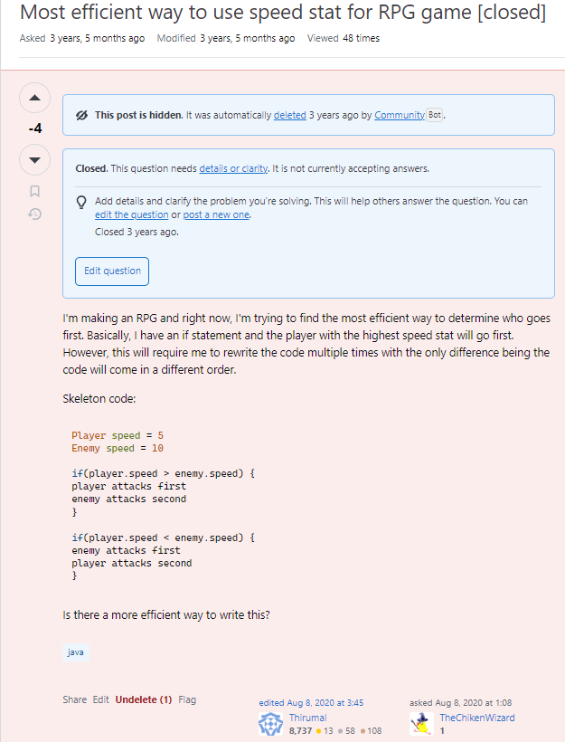

When I was growing up in school, I remember the teacher would always say, "Don't be afraid to ask questions", or "There are no such things as stupid questions". That however was not entirely true. If you cannot effectively communicate your question to the person answering your question, you will not get an effective answer back. If you ask a question completely unrelated to the topic of the class, you will indeed look stupid. Those are just a few examples of what a stupid question might look like. Now let me show you an example of a stupid question that I myself made back during high school. 

If you looked at my projects, you will notice that one of them is a turn based RPG game I made for a final project of my into to programming class. I had a small dilemma while coding. When coding the turn order, I essentially wrote that if the player has more speed than the enemy, then he will go first. If the enemy has more speed, the enemy will go first. However, in these if blocks, I essentially had to rewrite my entire battle sequence twice exactly the same way but with the orders just swapped. Keep in mind that this was back in my first year of coding so I forgot I could just make a function. Essentially, this just made it very annoying to have to code because anytime I made a change, I'd have to change it essentially 4 times, one for the player, the enemy, and then again for the player and the enemy but in the case the other went first. THis made things extremely annoying and bugs would constantly pop up.

Because of this, I decided to ask stack overflow (because ChatGPT wasn't out yet) and see what the internet had to say. I essentially asked them, "Hey, here's my code, how do I make it more efficient?" I had just assumed people would understand what I meant by more efficient, being able to condense the 4 copy and paste blocks of combat into 1. Instead, they thought I meant I was asking how to make my 10 line block of code run faster. They were visibly confused too because the actual solution was so simple that they didn't think I'd be that stupid. Here is an answer to my post that exemplifies this perfectly: "Use an “else”? (And handle if they’re equal.) I’m not sure what you’re asking, though; more efficient in what sense? You could keep player reference and swap their order, but without any context it’s difficult to know what kind of answer you’re expecting. – Dave Newton Aug 8, 2020 at 1:22". Unfortunately, I can't post the link to the actual question itself because it was deleted, but I feel like this question that I posted was so perfect for this essay that I just had to include it somehow. 

If you want to see a question that is actually good, check out [https://stackoverflow.com/questions/77819873/what-is-the-correct-output-of-sizeofstring]. The question is asking what is the correct output of sizeof("string"). In this question, the author first states the background information and context that the reader needs to understand the question that is about to asked. Then, he links his code as well as the output that he expects as well as the output that is actually produced. After all relevant information is given, he asks his question in one concise sentence. This is how you ask a question. You assume that the reader is completely clueless and that they need every single bit of information needed. 
